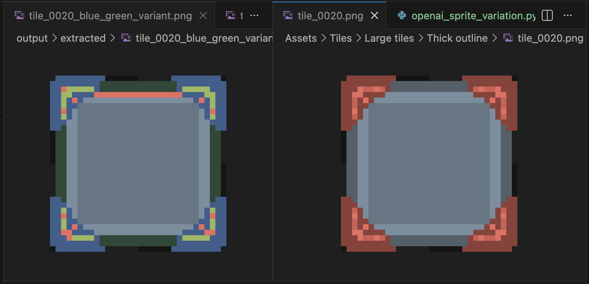

# pixel-matrix-pipeline

Deterministic pixel-art pipeline for browser game assets.

This project converts between PNG sprites and a JSON matrix format, performs deterministic palette operations, builds spritesheets with atlas metadata, and validates output integrity for game-engine use.

## Current Scope

### v0.0.1
- PNG loading (`load_png`)
- Palette extraction (`extract_palette`)
- Sprite -> matrix (`sprite_to_matrix`)
- Matrix -> PNG (`matrix_to_png`)
- Fixed-size tile slicing (`slice_tiles`)

### v0.0.2
- Deterministic spritesheet packing (`pack_sprites`)
- Atlas JSON generation (`generate_atlas`)

### v0.0.3 / v0.0.4
- Palette normalization (`normalize_palette`)
- Palette swap (`swap_palette`)
- Palette usage stats (`matrix_palette_stats`)

### v0.0.5 experiment
- OpenAI-driven sprite variation script with strict schema validation and retries

### v0.0.6 in progress
- TMX loader (`load_tmx`) and TSX loader (`load_tsx`)
- Tiled GID flag decoding (`decode_tiled_gid`)
- Tile ID -> source-region mapping (`map_tile_ids_to_regions`)
- Phaser-style atlas contract (`frames` + `meta`) with stricter validation

## Sprite Matrix Format

```json
{
  "width": 16,
  "height": 16,
  "palette": ["#RRGGBBAA"],
  "pixels": [[0, 1, 2]]
}
```

Rules:
- `palette` uses exact `#RRGGBBAA`
- `pixels` is `height` rows, each with `width` indices
- every pixel index must be within `0..len(palette)-1`

## Project Layout

- `src/pipeline/`: core modules
- `src/tools/`: CLI tools
- `src/tests/`: automated tests
- `scripts/`: optional higher-level scripts (OpenAI experiment)
- `samples/`: shareable examples
- `Assets/`: local source assets (ignored in git)

## Setup

```bash
python -m venv .venv
source .venv/bin/activate
pip install -r requirements.txt
```

## CLI Commands

Run all commands from project root.

### Extract tiles from tilesheet

```bash
python -m src.tools.extract_tiles "Assets/Tilesheets/Small tiles/Thin outline/tilemap_packed.png" 16 --output-dir output/tiles
```

### Sprite -> matrix

```bash
python -m src.tools.sprite_to_matrix output/tiles/tile_000.png --output-json output/tile_000.json
```

### Matrix -> sprite

```bash
python -m src.tools.matrix_to_sprite output/tile_000.json --output-png output/tile_000_rebuilt.png
```

### Build spritesheet + atlas

```bash
python -m src.tools.build_spritesheet output/tiles --tile-size 16 --output-image output/spritesheet.png --output-atlas output/atlas.json
```

### Normalize palette

```bash
python -m src.tools.normalize_palette output/extracted/tile_000.json --output-json output/extracted/tile_000.normalized.json
```

### Swap palette (+ optional PNG)

```bash
python -m src.tools.swap_palette output/extracted/tile_000.json --map '#FF0000FF=#00FF00FF' --map '#0000FFFF=#FFFFFFFF' --output-json output/extracted/tile_000.swapped.json --output-png output/extracted/tile_000.swapped.png
```

### Validate generated outputs

```bash
python -m src.tools.validate_outputs
```

## Python API (TMX/TSX)

Use the importer module directly for map/tileset ingestion:

```python
from src.pipeline.importer import load_tmx, load_tsx, map_tile_ids_to_regions

tmx = load_tmx("Assets/Tiled/sample-map.tmx")
tsx = load_tsx("Assets/Tiled/sample-sheet.tsx")

# Example: map first 10 gids from first layer to source image regions.
regions = map_tile_ids_to_regions(tmx["layers"][0]["gids"][:10], tsx, firstgid=1)
```

## OpenAI Variation Script (Experimental)

```bash
python scripts/openai_sprite_variation.py --input-json output/extracted/tile_0020.json --output-json output/extracted/tile_0020_blue_green_variant.json --output-png output/extracted/tile_0020_blue_green_variant.png --instruction "Recreate this tile with a blue box body and green corner accents. Keep shape and pixel-art shading style." --allow-palette-change --max-attempts 5
```

Notes:
- Requires `OPENAI_API_KEY`
- Output is schema-validated before writing

## Tests

```bash
python -m unittest discover -s src/tests -v
```

Current suite includes:
- pixel-perfect roundtrip checks
- spritesheet + atlas grid checks
- palette normalization/swap behavior checks
- TMX/TSX importer happy/failure path checks
- atlas contract validation checks (`frames` + `meta`)

## Sample Demo

Use `samples/blue_green_variation_demo/` to show the workflow with obvious visual changes.

### How to Generate This Sample

Run from project root:

```bash
# 1) Convert original sprite to matrix JSON
python -m src.tools.sprite_to_matrix \
  "Assets/Tiles/Large tiles/Thick outline/tile_0020.png" \
  --output-json samples/blue_green_variation_demo/original_tile_0020.json

# 2) Generate LLM variation JSON + PNG (blue body + green corners)
python scripts/openai_sprite_variation.py \
  --input-json samples/blue_green_variation_demo/original_tile_0020.json \
  --output-json samples/blue_green_variation_demo/blue_green_variant.json \
  --output-png samples/blue_green_variation_demo/blue_green_variant_rerendered.png \
  --instruction "Recreate this tile with a blue box body and green corner accents. Keep shape and pixel-art shading style." \
  --allow-palette-change \
  --max-attempts 5

# 3) Copy the original PNG and create result alias
cp "Assets/Tiles/Large tiles/Thick outline/tile_0020.png" samples/blue_green_variation_demo/original_tile_0020.png
cp samples/blue_green_variation_demo/blue_green_variant_rerendered.png samples/blue_green_variation_demo/result.png
```

### Images

Original sprite:


Blue/green variant (re-rendered from JSON):


Final result image (`result.png`):



### JSON Files

- `samples/blue_green_variation_demo/original_tile_0020.json`
- `samples/blue_green_variation_demo/blue_green_variant.json`

### JSON Differences

Generate a diff:

```bash
diff -u samples/blue_green_variation_demo/original_tile_0020.json samples/blue_green_variation_demo/blue_green_variant.json
```

Example excerpt:

```diff
@@ -3,10 +3,10 @@
   "height": 32,
   "palette": [
     "#00000000",
-    "#8E3F38FF",
-    "#515F6BFF",
+    "#3A5F8CFF",
+    "#2A4837FF",
     "#EC6A5EFF",
-    "#CF5E53FF",
+    "#9AB85BFF",
     "#778D9FFF",
     "#647685FF",
     "#637585FF"
```

## Asset Attribution

The following asset packs were used during testing and development:

- https://kenney.nl/assets/minimap-pack
- https://kenney.nl/assets/pico-8-platformer
- https://kenney.nl/assets/ui-pack-pixel-adventure

These assets belong to their respective authors/owners and are not redistributed here as project-owned art.


